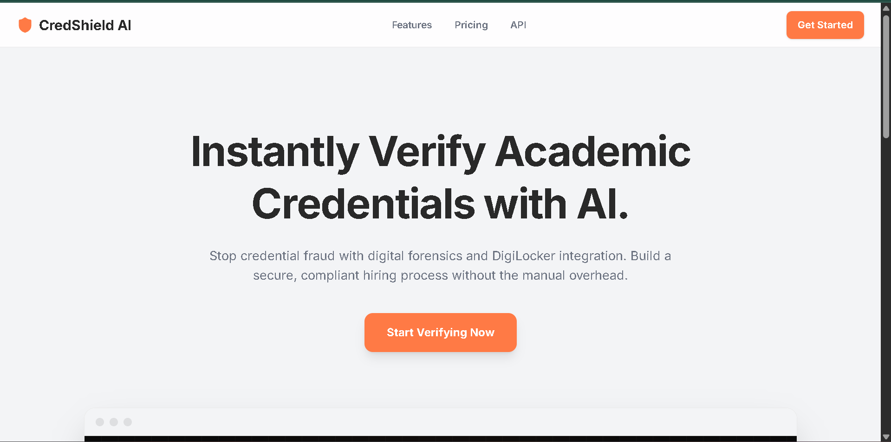

# CredShield AI: Forensic Certificate Verification System

CredShield is an AI-powered forensic verification system designed to automatically parse, analyze, and validate the authenticity of academic and professional certificates. The system integrates advanced Optical Character Recognition (OCR) text extraction with LLM-driven verification pipelines to detect fraudulent data and credential tampering.

## 📸 Application Preview

## 🚀 Features
* **Forensic Document Parsing:** Extracts raw textual data from certificate uploads using an optimized OCR workflow.
* **Intelligent Verification Layer:** Leverages Google Gemini to cross-reference and analyze certificate text structures, identifying inconsistencies or validation anomalies.
* **High-Performance API Backend:** Built using a asynchronous architecture to handle rapid document validation requests.

## 🛠️ Tech Stack
* **Language:** Python
* **Backend Framework:** FastAPI / Framework Ecosystem
* **AI Integration:** Google Gemini API (Structured Text Analysis)
* **Core Libraries:** Pydantic (Data Validation), Uvicorn (ASGI Server)
